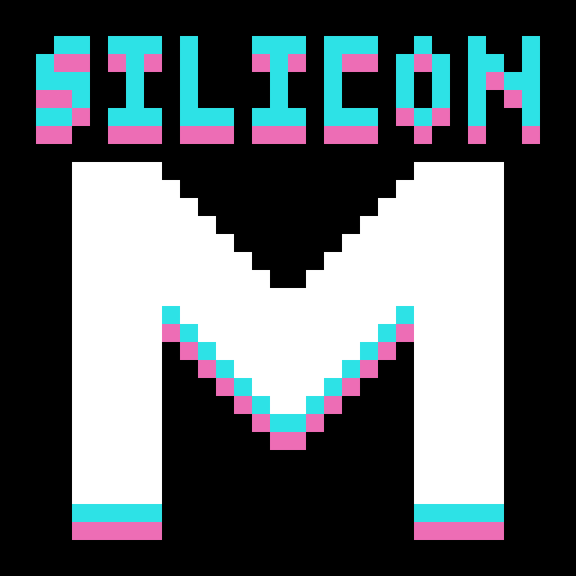

# Silicon Melbourne Website

Connecting the Melbourne Technology Community



## About

Silicon Melbourne is an inclusive community encompassing the entirety of Melbourne Technology. It's a community by and for the people on a journey to connect, support, unify, and contribute back to that community.

People at all stages of their career are welcome.

If you reside or work in Victoria, Australia come and join our discord or follow us on our socials. Links are on our [website](https://silicon.melbourne/).

## Getting Started

First, run the development server:

```bash
npm run dev
```

Open [http://localhost:3000](http://localhost:3000) with your browser to see the result.
